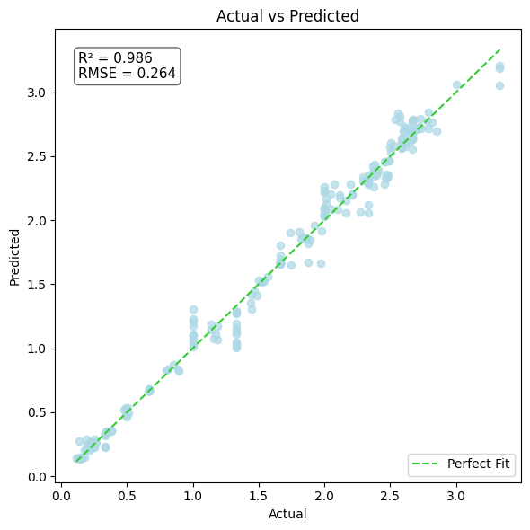

# BubbleColumnPhotoBioreactorOptimizer

Machine learning, exploratory data analysis, and optimization of **microalgal biomass prediction** in **bubble column photobioreactors (BCPRs)**, achieving **state-of-the-art predictive performance** on a newly published experimental dataset.

---

## Overview

This repository contains the complete workflow for analyzing and modeling biomass production in **Verrucodesmus verrucosus** cultivated in a **Bubble Column Photobioreactor (BCPR)**.

The project includes:

* Exploratory Data Analysis (EDA)
* Feature engineering
* Correlation analysis
* Biological interpretation of experimental variables
* Machine learning model development
* Model evaluation and comparison

Beyond reproducing the original study, this work uncovers additional biological insights and achieves improved predictive performance over previously reported machine learning benchmarks.

---

## Research Background

This project is based on the Elsevier Data in Brief publication:

> **"A comprehensive dataset of biomass and critical variables for *Verrucodesmus verrucosus* culture in bubble column photobioreactors"**

**Published:** 22 August 2025

The dataset consists of controlled cultivation experiments performed in a laboratory-scale bubble column photobioreactor.

---

## About the Dataset

The dataset records biomass production together with environmental and operational variables influencing microalgal growth.

### Experimental Conditions

| Parameter            | Value                      |
| -------------------- | -------------------------- |
| Organism             | *Verrucodesmus verrucosus* |
| Medium               | BG-11                      |
| Initial Cell Density | 1 × 10⁶ cells/mL           |
| Light Cycle          | 12 h Light / 12 h Dark     |
| Light Intensity      | 2000 lux                   |
| LED Spectrum         | 450–700 nm                 |
| Reactor Volume       | 2.25 L                     |
| pH Range             | 7–9                        |
| Biomass Measurement  | Dry weight (75°C)          |

---

## About Bubble Column Photobioreactors

A **Bubble Column Photobioreactor (BCPR)** is a vertical cylindrical reactor designed for cultivating photosynthetic microorganisms using gas bubbling instead of mechanical agitation.

### Key Design Features

* Vertical cylindrical geometry
* Aspect ratio typically between **2:1 and 6:1**
* Bottom-mounted sparger for controlled bubble generation
* Gas-induced mixing without mechanical stirrers
* Reactor diameter generally kept below **20 cm** to maximize light penetration and minimize self-shading

These characteristics make BCPRs energy-efficient and well suited for laboratory and industrial microalgae cultivation.

---

## Exploratory Data Analysis

The project investigates how environmental variables influence biomass production through statistical analysis and visualization.

### Correlation with Biomass

| Variable     | Correlation | Interpretation    |
| ------------ | ----------: | ----------------- |
| NO₃          |       -0.97 | Strong negative   |
| O₂ Gas       |       -0.98 | Strong negative   |
| CO₂ Gas      |       -0.95 | Strong negative   |
| Conductivity |       +0.81 | Strong positive   |
| pH           |       +0.78 | Strong positive   |
| Temperature  |       +0.31 | Moderate positive |
| Irradiance   |       +0.19 | Weak positive     |

---

## Biological Insights

### Nitrate (NO₃)

Nitrate exhibits the strongest negative correlation with biomass (**−0.97**), indicating that nitrogen availability is the primary limiting nutrient during cultivation.

As biomass increases, nitrate concentration decreases rapidly due to active nutrient uptake for protein synthesis, chlorophyll production, and cellular growth. This behavior is consistent with classical nitrogen-limited microalgal growth.

---

### pH

Biomass shows a strong positive relationship with pH (**+0.78**).

The maintained pH range of **7–9** provides favorable conditions for enzymatic activity and photosynthetic metabolism. Higher biomass concentrations are consistently observed under slightly alkaline conditions.

---

### Temperature

Temperature demonstrates only a moderate positive correlation (**+0.31**).

Within the experimental range, temperature remained relatively stable and therefore acted as a supporting environmental factor rather than a major growth-limiting variable.

---

### Gas Exchange

Both oxygen and carbon dioxide exhibit strong negative correlations with biomass.

| Variable | Correlation |
| -------- | ----------: |
| O₂ Gas   |       -0.98 |
| CO₂ Gas  |       -0.95 |

These trends reflect active photosynthetic metabolism:

* CO₂ is consumed during photosynthesis.
* O₂ is produced as a metabolic by-product.
* Gas composition therefore serves as an indirect indicator of culture health and biological activity.

---

## Machine Learning Models

Several regression algorithms were trained and evaluated for biomass prediction.

### Best Performing Model

| Model                   |  R² Score |
| ----------------------- | --------: |
| Random Forest Regressor | **0.986** |

The Random Forest model achieved the highest predictive performance, exceeding previously reported benchmarks for this dataset.

---

## Project Workflow

```text
Raw Dataset
      │
      ▼
Data Cleaning
      │
      ▼
Exploratory Data Analysis
      │
      ▼
Feature Engineering
      │
      ▼
Correlation Analysis
      │
      ▼
Model Training
      │
      ▼
Performance Evaluation
      │
      ▼
Biological Interpretation
```

---

---

## Results

### Correlation Analysis


The correlation matrix highlights the relationships between process variables and biomass production. Nitrate (NO₃), oxygen (O₂), and carbon dioxide (CO₂) exhibit strong negative correlations with biomass, reflecting nutrient consumption and active photosynthetic metabolism during microalgal growth. In contrast, conductivity and pH show strong positive correlations, indicating favorable conditions for biomass accumulation.

---

### Cluster Analysis

#### Elbow Method


The Elbow Method identifies the optimal number of clusters for the dataset. The within-cluster sum of squares decreases sharply until **K = 2**, after which the improvement becomes marginal. This indicates that the experimental observations naturally group into **two distinct clusters**, which were subsequently used for unsupervised analysis.

#### Principal Component Analysis (PCA)


Principal Component Analysis (PCA) projects the multidimensional experimental data into two principal components for visualization. The resulting scatter plot clearly separates the data into **two distinct clusters**, suggesting the presence of different cultivation states or growth regimes within the experimental conditions.

---

### Model Performance


Multiple regression models were evaluated for predicting biomass concentration. Among the tested algorithms, the **Random Forest Regressor** achieved the highest predictive performance with an **R² score of 0.986**, outperforming previously reported benchmarks on this dataset while maintaining low prediction error.

---

### Predicted vs. Actual Biomass



The fitting plot compares predicted biomass values against experimentally observed measurements. The close agreement between predictions and actual values demonstrates the model's ability to accurately capture the underlying relationship between environmental variables and biomass production across the dataset.

---

### Residual Analysis


Residual analysis shows that prediction errors are randomly distributed around zero without any obvious systematic trend. This indicates that the model captures the underlying data structure effectively and does not exhibit significant bias or heteroscedasticity, supporting the reliability of the regression model.


## Tech Stack

* Python
* NumPy
* Pandas
* Matplotlib
* Scikit-learn
* Jupyter Notebook

---

## Interactive Dashboard

A complete interactive analysis, including visualizations, feature relationships, and model results, is available here:

**https://bubblecolumnphotobioreactoroptimizer.streamlit.app**

> **Note:** The application is hosted on Streamlit Community Cloud. If the app is asleep, simply click the **"Wake App"** button. It usually becomes available within **5–15 seconds**.

---

## Citation

If you use this repository or the associated dataset, please cite the original publication:

> *A comprehensive dataset of biomass and critical variables for Verrucodesmus verrucosus culture in bubble column photobioreactors.*

Elsevier – *Data in Brief* (2025)

https://www.sciencedirect.com/science/article/pii/S2352340925007279

